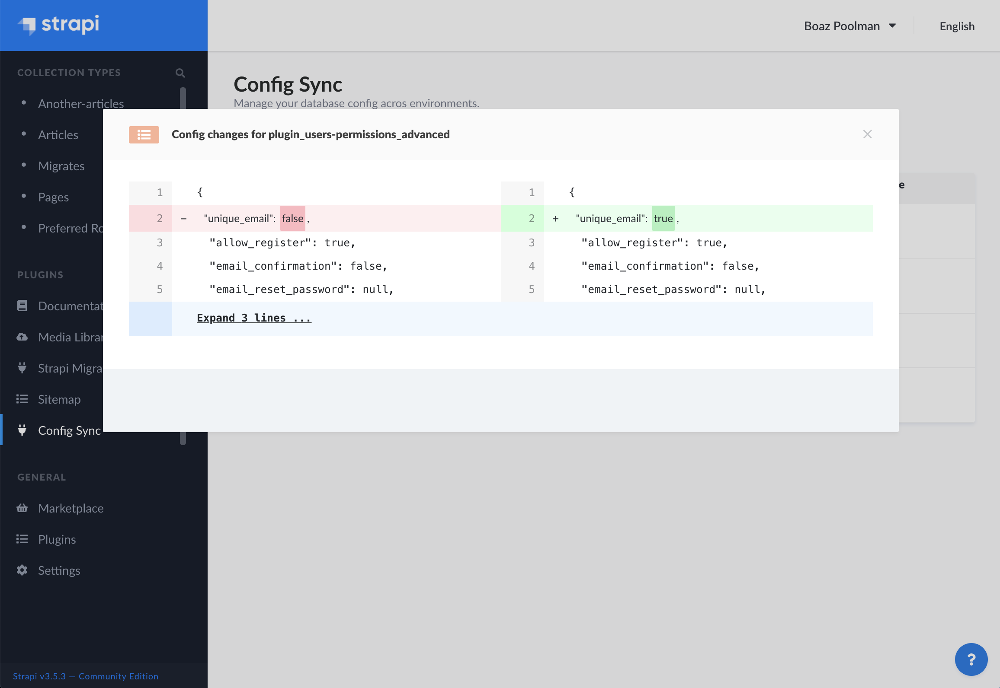

# Strapi Plugin Config Sync

A lot of configuration of your Strapi project is stored in the database. Like core_store, user permissions, user roles & webhooks. Things you might want to have the same on all environments. But when you update them locally, you will have to manually update them on all other environments too.

That's where this plugin comes in to play. It allows you to export these configs as individual JSON files for each config, and write them somewhere in your project. With the configs written in your filesystem you can keep track of them through version control (git), and easily pull and import them across environments.

Importing, exporting and keeping track of config changes is done in the admin page of the plugin.

**THIS PLUGIN IS NOT STABLE**

**PLEASE USE WITH CARE**

## Installation

Use `npm` or `yarn` to install and build the plugin.

	yarn add strapi-plugin-config-sync
	yarn build
	yarn develop

Add the export path to the `watchIgnoreFiles` list in `config/server.js`.
This way your app won't reload when you export the config in development.

##### `config/server.js`:

	admin: {
	  auth: {
     	// ...
	  },
	  watchIgnoreFiles: [
	    '**/config-sync/files/**',
	  ],
	},

## Settings
The settings of the plugin can be overridden in the `config/plugins.js` file. 
In the example below you can see how, and also what the default settings are.

##### `config/plugins.js`:
	module.exports = ({ env }) => ({
	  // ...
	  'config-sync': {
	    destination: "extensions/config-sync/files/",
	    minify: false,
	    importOnBootstrap: false,
	    include: [
	      "core-store",
	      "role-permissions"
	    ],
	    exclude: [
	      "core-store.plugin_users-permissions_grant"
	    ]
	  },
	  // ...
	});

| Property | Type | Description |
| -------- | ---- | ----------- |
| destination | string | The path for reading and writing the sync files. |
| minify | bool | When enabled all the exported JSON files will be minified. |
| importOnBootstrap | bool | Allows you to let the config be imported automaticly when strapi is bootstrapping (on `strapi start`). This setting should only be used in production, and should be handled very carefully as it can unintendedly overwrite the changes in your database. PLEASE USE WITH CARE. |
| include | array | Configs types you want to include in the syncing process. Allowed values: `core-store`, `role-permissions`, `webhooks`. |
| exclude | array | Specify the names of configs you want to exclude from the syncing process. By default the API tokens for users-permissions, which are stored in core_store, are excluded. This setting expects the config names to comply with the naming convention. |

## Naming convention
All the config files written in the file destination have the same naming convention. It goes as follows:

	[config-type].[config-name].json

- `config-type` - Corresponds to the value in from the include setting.
- `config-name` - The unique identifier of the config. 
	- 	For `core-store` config this is the `key` value.
	-  	For `role-permissions` config this is the `type` value.
	-  	For `webhooks` config this is the `id` value
  

## TODOs
- ~~Exporting of user roles & permissions~~
- ~~Exporting of webhooks~~
- ~~Specify which tables you want to track in the plugin configurations~~
- Exporting of EE roles & permissions
- Add partial import/export functionality
- Add CLI commands for importing/exporting
- ~~Track config deletions~~

## ⭐️ Show your support

Give a star if this project helped you.

## Credits
Shout out to [@ScottAgirs](https://github.com/ScottAgirs) for making [strapi-plugin-migrate](https://github.com/ijsto/strapi-plugin-migrate) as it was a big help while making the config-sync plugin.

## Resources

- [MIT License](LICENSE.md)

## Links

- [NPM package](https://www.npmjs.com/package/strapi-plugin-config-sync)
- [GitHub repository](https://github.com/boazpoolman/strapi-plugin-config-sync)
